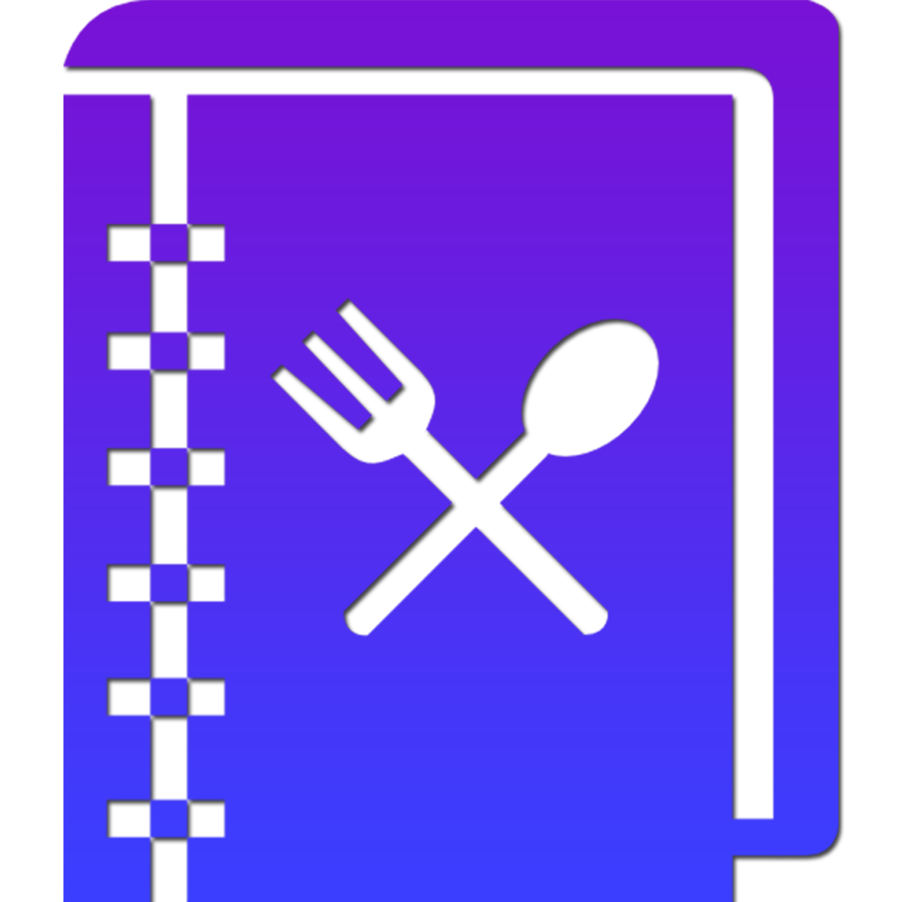
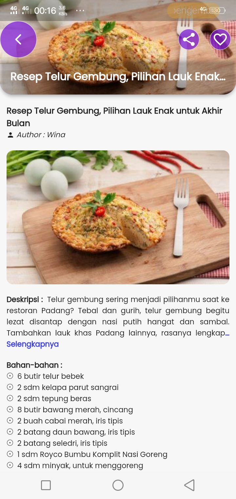

# Masakuy 

[Tugas Submission Dicoding](https://www.dicoding.com/academies/159)
 
 
 

    

 
<!-- ### Deskripsi Singkat -->
Aplikasi untuk mencari resep/menu makanan, pengguna dapat menandai resep-resep makanan sebagai "favorit" untuk dapat dilihat kembali di kemudian hari.

## Fitur

- Pencarian resep/menu makanan
- Favorit resep/menu
- Share screenshot detail resep/menu

## Dependencies

- share_plus: ^4.0.7
- screenshot: ^1.2.3
- flutter_bloc: ^8.0.1
- hydrated_bloc: ^8.1.0
- dll

## Sumber API

- https://github.com/tomorisakura/unofficial-masakapahariini-api

## Screenshot

    
    
    

## Demo APK

Download dan install dari link di bawah,

